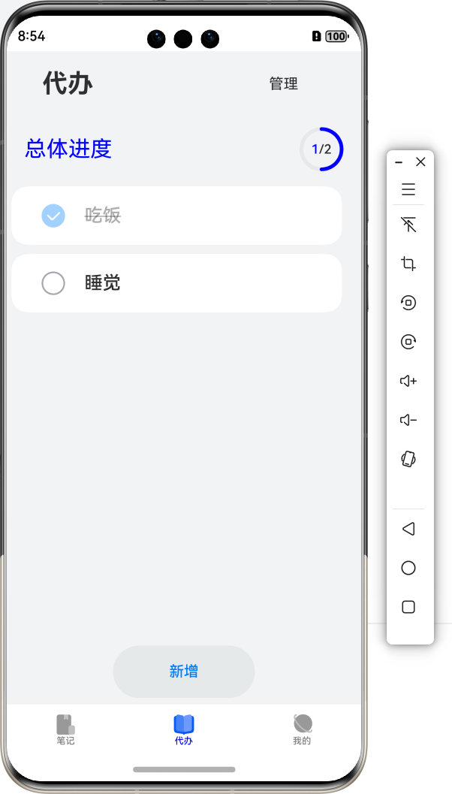

- [星记Star Note](#星记star-note)
  - [说明文档及简单演示](#说明文档及简单演示)
    - [概述](#概述)
    - [应用图标](#应用图标)
    - [初始界面(笔记)](#初始界面笔记)
    - [代办](#代办)
    - [关于](#关于)
      - [迷你浏览器](#迷你浏览器)
      - [随机二次元](#随机二次元)

# 星记Star Note

## 说明文档及简单演示

### 概述

这是一款基于HarmonyOS 5.0.0SDK的**纯血鸿蒙**应用，包含**1Ability+3Static Library**。

采用**100%ArkTS**编程，充分利用ArkUI的优良特性。

基于一个**Tab**布局，有机统一三个模块

使用**Navigation**实现父子页面之间的路由导航

集成**Webview**控件，内置功能完善的迷你浏览器

使用**HTTP**网络通信，获取二次元图片数据，经过处理展示。

利用鸿蒙内置的**Preferences**，完成数据持久化

大量使用**原生控件**，经过合适调整，保证较好的显示效果

### 应用图标

采用阿里巴巴矢量图标库的开源图标图片，保证版权合法

### 初始界面(笔记)

打开页面会首先进入最重要的**笔记**界面，这里通过prefereces保存着所有笔记

通过**管理**，我们可以删除已经不需要的笔记

点击新增或点击笔记，会进入笔记编辑界面，可以新增或修改笔记

### 代办

通过底部tab我们可以进入代办界面

点击新增会弹出dialog供我们新增代办

点击**管理**可以删除不需要的代办

删除后也会实时更新总体进度

### 关于

通过底部tab导航可以进入关于界面

#### 迷你浏览器

麻雀虽小，五脏俱全。这个迷你浏览器包含访问，返回，前进三个按钮，面对大部分应用场景都游刃有余。

#### 随机二次元

利用了公共API，这一部分可以获取一张随机二次元图片，陶冶情操。

点击图片可以切换下一张，每一张都独一无二哦。

